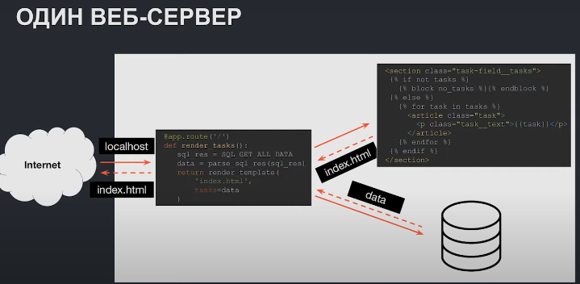
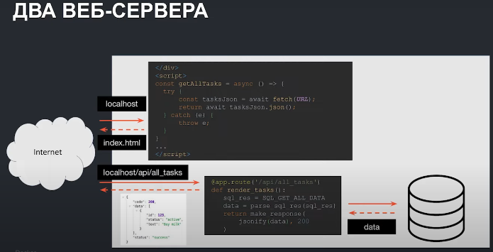
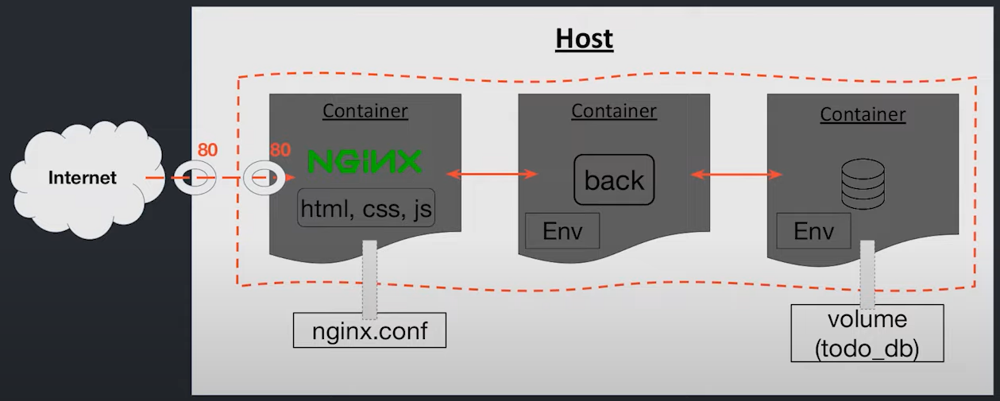

# Работа веб-приложения с одним и двумя веб-серверами
Как сделать интерфейс сайта. Как мы будем это делать?
## С одним веб-сервером


Мы могли бы использовать сам бекенд, то есть. Мы делаем запрос на наш сайт по адресу localhost. нам должна вернуться врестка и данные. Наш бекенд подхватывает этот роут и идет в БД и оттуда достает задачи. ЧТо дальше? На этом же бекенде есть папки темлейтс и статик, где хранятся статические файлы нашего сайта (html, css, js). Наш бекенд, когда возьмет данные из БД, попробует сгенерировать по шаблону какой-то финальный html-документ. И вернет полученную разметку в качестве ответа. То есть всего 1 веб-сервер. HTML, css лежат на бекенде.

## С двумя веб-серверами


Более совершенный вариант. Когда под фронтенд (статику) выделен отдельный вебсервер. В данном случае также делаем запрос на тот же локалхост, его принимает первый веб-сервер, на котором лежат html, css и js. Он отдает нам html-файл. Внутри первого веб-сервера есть запрос на бекенд. Получается, что мы под капотом, например, делаем запрос на localhost/api/all_tasks. Этот запрос попадает на второй веб-сервер, на котором крутится бекенд. Соответвенно наш бекенд сходит в БД, а затем он уже отдает не html, он будет собирать некий JSON с данными и отправлять его. Таким образом, у нас разделяется фронтенд и бекенд.

## Что мы соберем?
- Контейнер с фронтендом Nginx
- Контейнер с бекендом
- Контейнер с БД PostgreSQL

# Фронтенд Nginx
## Что такое Nginx?


Это HTTP-сервер, то есть он умеет обрабатывать HTTP-запросы. Мы будем его использовать для:
- Раздачи статических файлов (статики) (html, css и js)
- Проксирования запросов на бекенд. Что это значит? Когда мы будем делать запросы на бекенд, мы сходим не напрямую на второй веб-сервер, а сначала пройдем через Nginx. То есть мы делаем так, что сначала все запросы идут через Nginx, а Nginx уже будет решать, нужно ли по этому запросу отдать html-файл или же этот запрос нужно пропустить (проксировать на второй веб-сервер).

## Описание картинки - как работает Nginx
Мы заходим в интернет и вбиваем ссылку на наш сайт, в результате этого мы попадаем на сервер, где крутится контейнер с Nginx, бекендом и БД. Сервер по нужному порту понимает, что наш запрос нужно адресовать nginx, далле nginx смотрит на запрос и в ответ отдает файл index.html. В этом файле зашиты ссылки на файлы стилей и файлы js. Точно также делается запрос на наш сервер, который попадает опять в nginx. Тот опять смотрит на запрос и понимает, что теперь надо отдать файл style.css и script.js. Когда наш браузер прочитал полученный js он понимает, что опять нужно сделать запрос на сервер. Почнму? А все потому что в js мы первым делом дергаем ссылку на получение данных (fetch). Мы делаем еще один запрос на сервер, тот отдает его nginx. А вот теперь ситуация другая, nginx понимает, что запрос направлен на бекенд и пропускает его. В итоге этот запрос обрабаывается уже вторым веб-сервером, в результате, просыпается наш бекенд, идет в Postgres, получает из него данные и обратно по цепочке возвращается ответ.

## Файл конфигурации nginx
См. тут - [ссылка](nginx/nginx.conf)
Файл очень упрощенный. Что тут важно:
- директива ```listen``` - в ней мы указываем какой порт будем слушать - 80
- ```server_name``` - в качестве ссылки будем вводить не ip-адрес сервера, а просто домен
Следующий блок nginx связан с проксированием запросов на бекенд:
```
location /api {
            proxy_pass http://backend:8000/api;
```
В нашем фронтенде для получения, сохранения или удаления задачи будет дергаться ссылка api. Этот путь поймает Nginx и перенаправит его по адресу в бекенд с портом 8000 и роутом api: *http://backend:8000/api*. Здесь backend - это название контейнера с бекендом.

И последняя директива это путь на просто слеш:
```
location / {
            root /nginx/static;
            try_files /$base /index.html =404;
        }
```
 Здесь мы будем отдавать статику, сюда пойдет css, js и основной идекс html.

Итак, рассмотрим основные директории и особенности проекта:
- backend - все как и в прошлом уроке, только изменено подключение к БД, убран хардкод - данные тянем из переменных окружения.
- database - Dockerfile с postgresql, который расширяется скриптом init_db.sh. Данный скрипт создает нужную нам таблицу, если она еще не создана.
- frontend - это фронт, довольно сложный SPA (single page application), очень близкий к проду. Здесь также используется TypeScript, который не поддерживается браузерами. Но его нужно скомпилировать в js, который поймет браузер. И вот как в таком случае написать Dockerfile? 

Первый вариант - локально собрать css, js и index.html и добавить в контейнер. Однако при таком подходе придется постоянно пересобирать наш фронтенд перед тем как обновить образ. 

# Multi-stage build
Многоэтапная сборка - особенность Docker, которая позволяет компилировать и запускать программу в контейнере (c, c++ и т.д.). Как это работает? В Dockerfile мы как минимум задаем 2 инструкции FROM. Причем первую как-то называем. Весь смысл в том, что если мы вот так укажем инструкцию в одном Dockerfile у нас между сборками будут доступны, так называемые, артефакты, в результате мы сможем использовать файлы первой сборки во второй.

Посмотрим на примере. Многоэтапные сборки можно использовать не только для комплилируемых языков. Вот пример с питоном:
```Dockerfile
# Сборка №1 задаем исходный образ питона и эту сборку называем PARSER
FROM python AS PARSER
WORKDIR /app

COPY ./app/requirements.txt ./requirements.txt
RUN python -m pip install --upgrade pip && pip install -r requirements.txt

COPY ./*csv ./data/
COPY ./app/parse_data.py ./parse_data.py
RUN python3 ./parse_data.py # ТУт поулчаем файл result.txt - артефакт

# Сборка №2
FROM python:alpine
COPY ./app/create_report.py /app/create_report.py

# Мы копируем полученный файл из первой сборки во вторую
COPY --from=PARSER /app/result.txt /app/result.txt
ENTRYPOINT ["python3", "-u", "/app/create_report.py"]
```

В целом, очень полезный инструмент, так как позволяет значительно уменьшить конечный размерый образа. Так как, например, могут использоваться какие-то библиотеки для сборки, а в рантайме они не нужны (их можно выкинуть во второй сборке и использовать их результат работы из первой сборки).

# Сборка фронтенда
Сборка фронта и комментарии в папке frontend в файле [Dockerfile](frontend/Dockerfile).

Собираем backend, [Dockerfile](backend/Dockerfile):
```bash
docker build -t 7_back .
```

Собираем БД, [Dockerfile](database/Dockerfile):
```bash
docker build -t 7_database .
```

Собираем frontend, [Dockerfile](frontend/Dockerfile):
```bash
docker build -t 7_nginx .
```
Теперь если посмотреть список образов:
```bash
docker images
```
Обращаем внимание на 2 последних образа. Последний 7_nginx весит ~ 140 Мб и предпоследний без имени и тега весит почти 1.5 Гб. Вот и польза многоэтапной сборки, сэкономили много места на диске. 

# Веб-приложение в контейнерах

Создадим том для сохранения из БД кликхаус:
```bash
docker volume create todo_db
```

Создадим сеть
```bash
docker network create todo_net
```

Как это все запустить?
Команды и комментарии к ним смотреть в файле [Commands.md](Commands.md)

Все, наш сайт готов!
## Интерфейс сайта:


## Итоговая схема:
